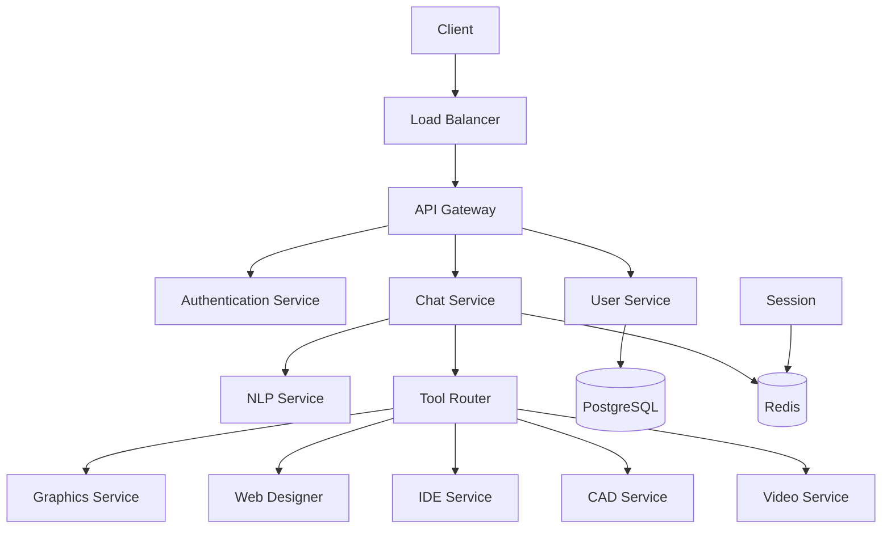
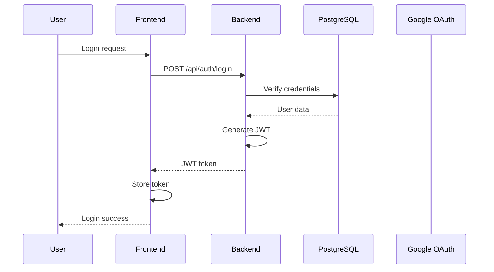
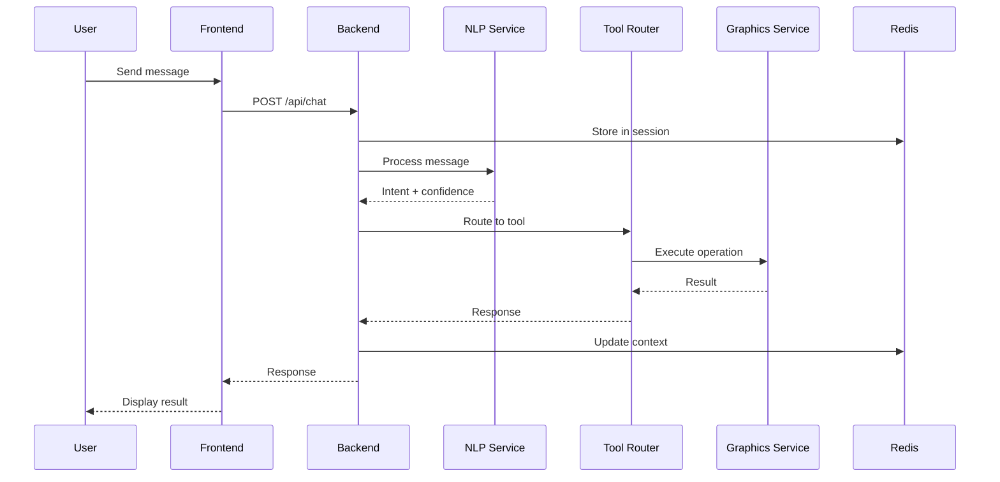
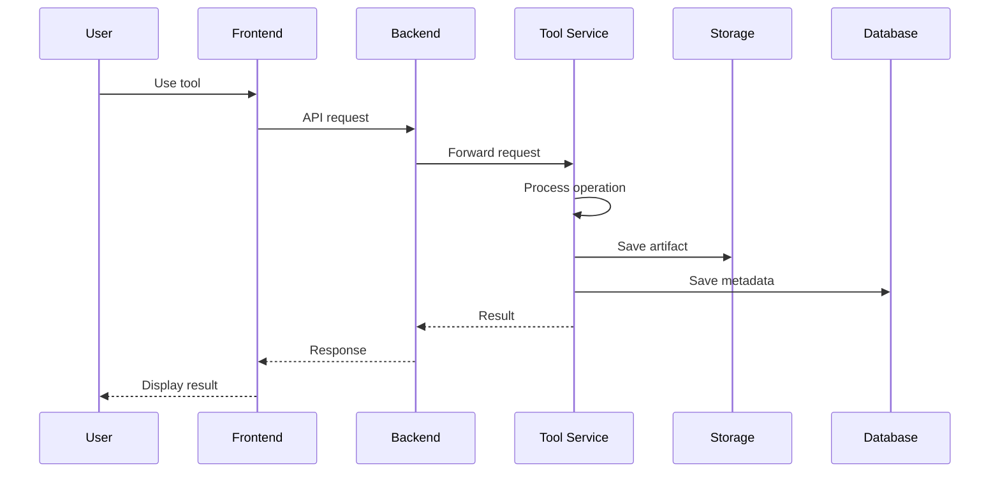

# AIO Creative Hub - Service Architecture

## Table of Contents
1. [Overview](#overview)
2. [Architecture Principles](#architecture-principles)
3. [System Components](#system-components)
4. [Service Details](#service-details)
5. [Data Flow](#data-flow)
6. [Technology Stack](#technology-stack)
7. [Infrastructure](#infrastructure)
8. [Security Architecture](#security-architecture)
9. [Scalability & Performance](#scalability--performance)
10. [Monitoring & Observability](#monitoring--observability)

## Overview

AIO Creative Hub is a cloud-native, microservices-based platform that provides a unified interface for multiple creative tools through natural language processing. Users interact with the platform via a chat interface, and the system intelligently routes requests to the appropriate creative tool service.

### Key Features
- **Natural Language Processing**: AI-powered intent classification and tool routing
- **Multi-Tool Integration**: Graphics design, web development, code execution, 3D modeling, video editing
- **Real-time Collaboration**: WebSocket-based real-time communication
- **Google Drive Integration**: Seamless file storage and synchronization
- **Scalable Architecture**: Containerized microservices with horizontal scaling capabilities

## Architecture Principles

### 1. Microservices Architecture
- **Single Responsibility**: Each service has a clearly defined business capability
- **Decentralized Data Management**: Each service manages its own data
- **Fault Isolation**: Failures in one service don't cascade to others
- **Technology Agnostic**: Services can be developed in different technologies

### 2. API-First Design
- **RESTful APIs**: Standard HTTP methods and status codes
- **OpenAPI Documentation**: Comprehensive API documentation
- **Versioning**: URL-based API versioning (e.g., `/api/v1/`)
- **Contract-Driven Development**: Well-defined service contracts

### 3. Event-Driven Communication
- **Asynchronous Processing**: Non-blocking request handling
- **Service Decoupling**: Services communicate via events
- **Scalability**: Events can be processed independently

### 4. Security by Design
- **Zero Trust Architecture**: Verify every request
- **Defense in Depth**: Multiple layers of security
- **Principle of Least Privilege**: Minimal access rights
- **Data Encryption**: At rest and in transit

## System Components

### High-Level Architecture

```
┌─────────────────────────────────────────────────────────────┐
│                     Client Layer                              │
│  ┌──────────────┐  ┌──────────────┐  ┌──────────────┐      │
│  │   Web App    │  │ Mobile App   │  │  API Client  │      │
│  │   (React)    │  │   (Future)   │  │              │      │
│  └──────────────┘  └──────────────┘  └──────────────┘      │
└─────────────────────────────────────────────────────────────┘
                           │
                           │ HTTPS/WSS
                           ▼
┌─────────────────────────────────────────────────────────────┐
│                 Load Balancer / Reverse Proxy                │
│                     (Nginx)                                  │
└─────────────────────────────────────────────────────────────┘
                           │
                           ▼
┌─────────────────────────────────────────────────────────────┐
│                     API Gateway Layer                        │
│  ┌────────────────────────────────────────────────────────┐ │
│  │  Backend API (Express.js)                              │ │
│  │  - Authentication & Authorization                      │ │
│  │  - Request Routing                                     │ │
│  │  - Rate Limiting                                       │ │
│  │  - API Composition                                     │ │
│  └────────────────────────────────────────────────────────┘ │
└─────────────────────────────────────────────────────────────┘
                           │
                ┌──────────┴──────────┐
                ▼                     ▼
┌────────────────────────┐   ┌────────────────────────┐
│   Service Layer        │   │   Service Layer        │
│  ┌──────────────────┐  │   │  ┌──────────────────┐  │
│  │  Chat Interface  │  │   │  │  Creative Tools  │  │
│  └──────────────────┘  │   │  └──────────────────┘  │
│  ┌──────────────────┐  │   │  ┌──────────────────┐  │
│  │  Session Mgmt    │  │   │  │ - Graphics       │  │
│  └──────────────────┘  │   │  │ - Web Designer   │  │
│  ┌──────────────────┐  │   │  │ - IDE            │  │
│  │  User Mgmt       │  │   │  │ - CAD            │  │
│  └──────────────────┘  │   │  │ - Video          │  │
│  ┌──────────────────┐  │   │  └──────────────────┘  │
│  │  NLP Service     │  │   │                        │
│  └──────────────────┘  │   │                        │
└────────────────────────┘   └────────────────────────┘
                           │
                           ▼
┌─────────────────────────────────────────────────────────────┐
│                Data & Storage Layer                          │
│  ┌──────────────┐  ┌──────────────┐  ┌──────────────┐      │
│  │ PostgreSQL   │  │    Redis     │  │  File Storage│      │
│  │  (Primary    │  │   (Cache &   │  │   (Local/    │      │
│  │   DB)        │  │   Sessions)  │  │   Cloud)     │      │
│  └──────────────┘  └──────────────┘  └──────────────┘      │
└─────────────────────────────────────────────────────────────┘
```

### Component Interaction



## Service Details

### 1. Backend API Service
**Technology**: Node.js, Express.js, TypeScript
**Port**: 3000
**Responsibilities**:
- API request handling and routing
- Authentication and authorization
- Session management
- Rate limiting
- Request validation
- Response formatting

**Key Features**:
- JWT-based authentication
- OAuth 2.0 integration (Google)
- WebSocket support for real-time communication
- Comprehensive error handling
- Request/response logging

**Endpoints**:
- `/api/auth/*` - Authentication
- `/api/users/*` - User management
- `/api/chat/*` - Chat interface
- `/api/tools/*` - Tool operations
- `/api/artifacts/*` - Artifact management
- `/health` - Health check

### 2. NLP Service
**Technology**: Python, FastAPI, spaCy
**Port**: 3006
**Responsibilities**:
- Intent classification
- Entity extraction
- Tool routing
- Confidence scoring
- Context management

**Key Features**:
- spaCy NLP pipeline
- Custom training data
- 70% confidence threshold
- Fallback mechanism for low confidence
- Context preservation

**Endpoints**:
- `/process` - Process user input
- `/health` - Health check

### 3. Graphics Service
**Technology**: Node.js, Express.js, Sharp, Fabric.js
**Port**: 3001
**Responsibilities**:
- Canvas creation and management
- Image manipulation
- Layer management
- Export functionality
- Undo/redo operations

**Key Features**:
- Multi-format support (PNG, JPG, SVG, WebP)
- Layer-based editing
- 50-operation history
- Non-destructive editing
- Real-time previews

**Endpoints**:
- `/canvas` - Canvas operations
- `/export` - Export canvas
- `/health` - Health check

### 4. Web Designer Service
**Technology**: Node.js, Express.js, GrapesJS
**Port**: 3002
**Responsibilities**:
- HTML/CSS generation
- Component management
- Responsive design
- Accessibility checks
- Framework-specific code generation

**Key Features**:
- GrapesJS integration
- WCAG 2.1 Level AA compliance
- Multiple framework support
- Live preview
- Code validation

**Endpoints**:
- `/generate` - Generate code
- `/validate` - Validate code
- `/health` - Health check

### 5. IDE Service
**Technology**: Node.js, Express.js, Docker
**Port**: 3003
**Responsibilities**:
- Code execution
- Syntax validation
- Security enforcement
- Resource management
- Multi-language support

**Key Features**:
- Sandboxed execution
- Support for Python, JavaScript, Java, C++
- Resource limits (CPU, memory, disk)
- Security vulnerability detection
- Real-time execution feedback

**Endpoints**:
- `/execute` - Execute code
- `/validate` - Validate syntax
- `/health` - Health check

### 6. CAD Service
**Technology**: Node.js, Express.js, Three.js
**Port**: 3004
**Responsibilities**:
- 3D model generation
- Mesh operations
- 3D rendering
- Export functionality
- View management

**Key Features**:
- Primitive-based modeling
- Multiple view support (orthographic, perspective)
- Metric and imperial units
- Multiple export formats (STL, OBJ, GLTF)
- Real-time rendering

**Endpoints**:
- `/model` - Model operations
- `/export` - Export model
- `/health` - Health check

### 7. Video Service
**Technology**: Node.js, Express.js, FFmpeg.js
**Port**: 3005
**Responsibilities**:
- Video processing
- Timeline management
- Effect application
- Render management
- Progress tracking

**Key Features**:
- Multi-format support (MP4, AVI, MOV, WebM)
- Frame-accurate positioning
- Non-destructive effects
- Progress indication
- Background rendering

**Endpoints**:
- `/process` - Process video
- `/render` - Render video
- `/health` - Health check

### 8. Frontend Application
**Technology**: React 18, TypeScript, Vite, Tailwind CSS
**Port**: 80 (Nginx)
**Responsibilities**:
- User interface
- State management
- Real-time updates
- File management
- Tool integration

**Key Features**:
- React 18 with concurrent features
- Redux Toolkit for state management
- Real-time WebSocket communication
- Responsive design
- TypeScript for type safety

**Pages**:
- `/` - Landing page
- `/dashboard` - User dashboard
- `/chat` - Chat interface
- `/tools/*` - Tool-specific interfaces

## Data Flow

### User Authentication Flow



### Chat Request Flow



### Creative Tool Flow



## Technology Stack

### Backend Services
- **Runtime**: Node.js 18+, Python 3.11+
- **Framework**: Express.js (Node), FastAPI (Python)
- **Language**: TypeScript, Python
- **Database**: PostgreSQL 15
- **Cache**: Redis 7
- **Message Queue**: (Future enhancement)

### Frontend
- **Framework**: React 18
- **Language**: TypeScript
- **Build Tool**: Vite
- **Styling**: Tailwind CSS
- **State Management**: Redux Toolkit
- **Routing**: React Router
- **Testing**: Jest, React Testing Library

### Creative Tools
- **Graphics**: Sharp, Fabric.js, Canvas API
- **Web Design**: GrapesJS
- **IDE**: Docker, Monaco Editor
- **3D Modeling**: Three.js, OpenJSCAD
- **Video**: FFmpeg.js

### Infrastructure
- **Containerization**: Docker
- **Orchestration**: Docker Compose, Kubernetes (optional)
- **Load Balancer**: Nginx
- **Reverse Proxy**: Nginx
- **SSL/TLS**: Let's Encrypt, self-signed (dev)

### Monitoring & Observability
- **Metrics**: Prometheus
- **Visualization**: Grafana
- **Logging**: ELK Stack (Elasticsearch, Logstash, Kibana)
- **Tracing**: Jaeger
- **Alerting**: Alertmanager
- **Error Tracking**: Custom service

## Infrastructure

### Deployment Environments

#### Development
- **Location**: Local Docker Compose
- **Database**: PostgreSQL in Docker
- **Cache**: Redis in Docker
- **Storage**: Local filesystem
- **SSL**: Self-signed certificates

#### Staging
- **Location**: Cloud infrastructure
- **Database**: Managed PostgreSQL
- **Cache**: Managed Redis
- **Storage**: Cloud storage
- **SSL**: Let's Encrypt

#### Production
- **Location**: Cloud infrastructure
- **Database**: Managed PostgreSQL (HA)
- **Cache**: Managed Redis (HA)
- **Storage**: Cloud storage (CDN)
- **SSL**: Let's Encrypt or commercial CA

### Network Architecture

```
Internet
    │
    ▼
┌───────────────┐
│   Load        │
│   Balancer    │
│   (Nginx)     │
└───────┬───────┘
        │
        ├──────┬──────┬──────┬──────┐
        ▼      ▼      ▼      ▼      ▼
    ┌─────┐ ┌─────┐ ┌─────┐ ┌─────┐ ┌─────┐
    │ FE  │ │ BE  │ │ NLP │ │ Graf│ │ Web │
    │ 80  │ │3000 │ │3006 │ │3001 │ │3002 │
    └─────┘ └─────┘ └─────┘ └─────┘ └─────┘
        │      │      │      │      │
        └──────┴──────┴──────┴──────┘
                   │
                   ▼
        ┌──────────┴──────────┐
        ▼                     ▼
    ┌─────────┐          ┌─────────┐
    │PostgreSQL│          │  Redis  │
    └─────────┘          └─────────┘
```

### Data Storage

#### PostgreSQL
**Purpose**: Primary database
**Data**:
- Users
- Sessions
- Chat messages
- Artifacts metadata
- Tool configurations

**Schema**:
```sql
-- Core tables
users
sessions
chat_sessions
messages
artifacts
tools_usage
user_preferences
```

#### Redis
**Purpose**: Caching and session storage
**Data**:
- User sessions
- Cache (frequently accessed data)
- Real-time data
- Rate limiting counters
- WebSocket connection mapping

#### File Storage
**Purpose**: Artifact and file storage
**Structure**:
```
/storage/
  /artifacts/
    /{userId}/
      /{artifactId}/
        - file data
        - metadata.json
  /temp/
    - temporary files
  /exports/
    - exported files
```

## Security Architecture

### Authentication & Authorization

#### Authentication Flow
1. User submits credentials
2. Backend validates credentials
3. Backend generates JWT (RS256 algorithm)
4. JWT contains user ID, roles, expiration
5. Frontend stores JWT (httpOnly cookie or localStorage)
6. Frontend sends JWT in Authorization header

#### Authorization Levels
- **Public**: Health check endpoints
- **Authenticated**: All API endpoints
- **Admin**: User management, system configuration
- **Service**: Internal service-to-service communication

#### Security Headers
```
X-Content-Type-Options: nosniff
X-Frame-Options: DENY
X-XSS-Protection: 1; mode=block
Strict-Transport-Security: max-age=31536000; includeSubDomains
Content-Security-Policy: default-src 'self'
```

### Data Protection

#### Encryption
- **At Rest**: Database encryption, file system encryption
- **In Transit**: TLS 1.3 for all communications
- **Application**: Password hashing (bcrypt), JWT signing (RS256)

#### PII Protection
- Personal data encrypted in database
- Sensitive logs redacted
- API responses filter sensitive fields
- GDPR compliance features

### Network Security

#### Firewall Rules
```
# Allow inbound
80/tcp    - HTTP
443/tcp   - HTTPS
22/tcp    - SSH (restricted)

# Internal (Docker network)
3000/tcp  - Backend API
3001/tcp  - Graphics Service
3002/tcp  - Web Designer
3003/tcp  - IDE Service
3004/tcp  - CAD Service
3005/tcp  - Video Service
3006/tcp  - NLP Service
5432/tcp  - PostgreSQL (internal only)
6379/tcp  - Redis (internal only)
```

#### Rate Limiting
- **Global**: 1000 requests/minute per IP
- **Authentication**: 5 attempts/minute per IP
- **Tool Usage**: 60 requests/minute per user
- **File Upload**: 20 requests/minute per user

### Vulnerability Management

#### OWASP Top 10 Mitigation
1. **Injection**: Parameterized queries, input validation
2. **Broken Authentication**: JWT, MFA, session management
3. **Sensitive Data Exposure**: Encryption, TLS
4. **XML External Entities**: Disable XML external entities
5. **Broken Access Control**: Role-based authorization
6. **Security Misconfiguration**: Automated security scanning
7. **Cross-Site Scripting**: Content Security Policy, input sanitization
8. **Insecure Deserialization**: Type validation, safe libraries
9. **Known Vulnerabilities**: Dependency scanning, regular updates
10. **Insufficient Logging**: Comprehensive logging, monitoring

## Scalability & Performance

### Horizontal Scaling

#### Load Distribution
- **Nginx**: Round-robin load balancing
- **Sticky Sessions**: WebSocket connections
- **Health Checks**: Automatic failover
- **Auto-scaling**: Based on CPU/memory metrics

#### Service Scaling
```yaml
# Example scaling configuration
services:
  backend:
    deploy:
      replicas: 3
      resources:
        limits:
          cpus: '0.5'
          memory: 512M
  graphics-service:
    deploy:
      replicas: 2
      resources:
        limits:
          cpus: '1'
          memory: 1G
```

### Performance Optimization

#### Caching Strategy
- **L1**: Application cache (in-memory)
- **L2**: Redis cache
- **L3**: CDN for static assets
- **Database**: Query optimization, indexing

#### Database Optimization
- **Connection Pooling**: PgBouncer
- **Read Replicas**: For read-heavy operations
- **Partitioning**: For large tables
- **Indexing**: Strategic index placement

#### API Performance
- **Pagination**: All list endpoints
- **Compression**: gzip/Brotli
- **Caching Headers**: Cache-Control, ETag
- **Response Filtering**: Select specific fields

### Capacity Planning

#### Current Capacity
- **Concurrent Users**: 100
- **Requests/Second**: 500
- **Data Storage**: 10 GB
- **Bandwidth**: 1 Gbps

#### Projected Growth (1 year)
- **Concurrent Users**: 1,000
- **Requests/Second**: 5,000
- **Data Storage**: 100 GB
- **Bandwidth**: 10 Gbps

## Monitoring & Observability

### Metrics Collection

#### Application Metrics
- Request rate and latency
- Error rates
- Business metrics (user registrations, tool usage)
- Custom business KPIs

#### Infrastructure Metrics
- CPU, memory, disk usage
- Network throughput
- Container health
- Database performance

#### Tool-Specific Metrics
- Graphics: Canvas operations, export time
- Web Designer: Code generation time, validation errors
- IDE: Code execution time, sandbox resource usage
- CAD: Model generation time, complexity
- Video: Processing time, render queue

### Logging Strategy

#### Log Levels
- **ERROR**: System errors, exceptions
- **WARN**: Warning conditions, rate limiting
- **INFO**: Normal operations, business events
- **DEBUG**: Detailed debugging information

#### Log Aggregation
- **Format**: Structured JSON
- **Correlation ID**: End-to-end request tracking
- **Retention**: 90 days (hot), 1 year (cold)
- **Search**: Kibana for log analysis

### Distributed Tracing

#### Traced Operations
- HTTP requests
- Database queries
- Tool operations
- External API calls
- Message queue operations

#### Jaeger Integration
- Service dependency visualization
- Request flow analysis
- Performance bottleneck identification
- Error correlation across services

### Alerting

#### Alert Categories
- **Critical**: Service down, high error rate, security breach
- **Warning**: High latency, low disk space, rate limit warnings
- **Info**: Deployment notifications, threshold crossings

#### Notification Channels
- Email (primary)
- Slack (critical)
- PagerDuty (on-call)

## Future Enhancements

### Planned Features
1. **Multi-tenancy**: Support for organizations
2. **Advanced NLP**: Custom model training
3. **Mobile Apps**: iOS and Android
4. **Plugin System**: Third-party integrations
5. **Collaborative Editing**: Real-time multi-user
6. **Advanced Analytics**: ML-based insights

### Technical Improvements
1. **Event Sourcing**: For audit trails
2. **CQRS**: Command Query Responsibility Segregation
3. **GraphQL**: Flexible API querying
4. **gRPC**: High-performance inter-service communication
5. **Service Mesh**: Istio for advanced networking

## Conclusion

The AIO Creative Hub architecture is designed for scalability, maintainability, and security. The microservices approach allows for independent development and deployment of services, while the comprehensive monitoring and observability stack ensures operational excellence. The architecture supports the platform's vision of providing an intuitive, AI-powered creative tool suite accessible through natural language interaction.
