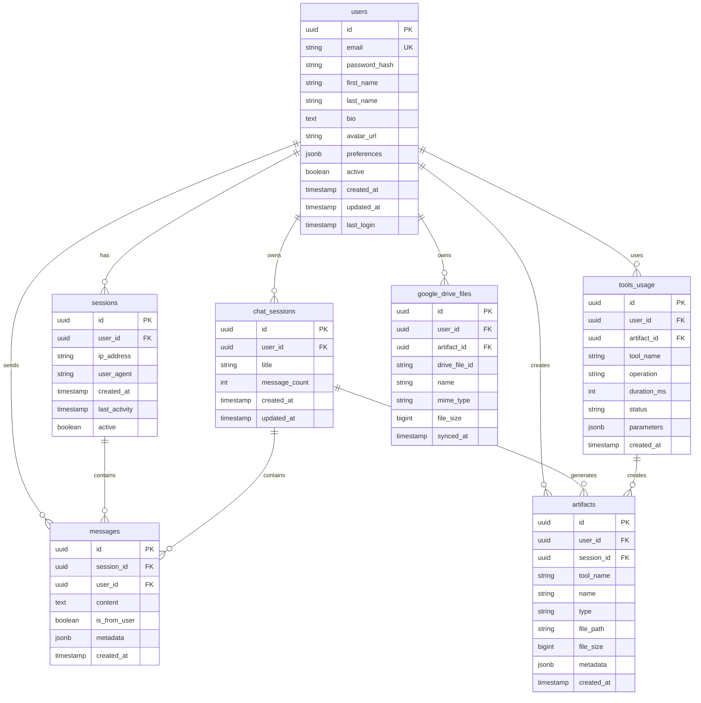

# AIO Creative Hub - Database Schema Documentation

## Overview

The AIO Creative Hub uses PostgreSQL as its primary database. This document describes the database schema, relationships, and best practices.

## Schema Diagram



## Table Specifications

### users

Stores user account information.

```sql
CREATE TABLE users (
    id UUID PRIMARY KEY DEFAULT gen_random_uuid(),
    email VARCHAR(255) UNIQUE NOT NULL,
    password_hash VARCHAR(255),
    first_name VARCHAR(100) NOT NULL,
    last_name VARCHAR(100) NOT NULL,
    bio TEXT,
    avatar_url VARCHAR(500),
    preferences JSONB DEFAULT '{}',
    active BOOLEAN DEFAULT true,
    created_at TIMESTAMP WITH TIME ZONE DEFAULT CURRENT_TIMESTAMP,
    updated_at TIMESTAMP WITH TIME ZONE DEFAULT CURRENT_TIMESTAMP,
    last_login TIMESTAMP WITH TIME ZONE
);

CREATE INDEX idx_users_email ON users(email);
CREATE INDEX idx_users_active ON users(active);
CREATE INDEX idx_users_created_at ON users(created_at);
```

**Fields:**
- `id`: Unique identifier (UUID)
- `email`: User's email address (unique)
- `password_hash`: Hashed password (nullable for OAuth users)
- `first_name`: User's first name
- `last_name`: User's last name
- `bio`: User biography
- `avatar_url`: Profile picture URL
- `preferences`: JSON field for user preferences
- `active`: Account status
- `created_at`: Account creation timestamp
- `updated_at`: Last update timestamp
- `last_login`: Last login timestamp

### sessions

Tracks user sessions for security and tracking.

```sql
CREATE TABLE sessions (
    id UUID PRIMARY KEY DEFAULT gen_random_uuid(),
    user_id UUID NOT NULL REFERENCES users(id) ON DELETE CASCADE,
    ip_address INET,
    user_agent TEXT,
    created_at TIMESTAMP WITH TIME ZONE DEFAULT CURRENT_TIMESTAMP,
    last_activity TIMESTAMP WITH TIME ZONE DEFAULT CURRENT_TIMESTAMP,
    active BOOLEAN DEFAULT true
);

CREATE INDEX idx_sessions_user_id ON sessions(user_id);
CREATE INDEX idx_sessions_active ON sessions(active);
CREATE INDEX idx_sessions_last_activity ON sessions(last_activity);
```

**Fields:**
- `id`: Session identifier (UUID)
- `user_id`: Reference to user
- `ip_address`: Client IP address
- `user_agent`: Client user agent
- `created_at`: Session creation time
- `last_activity`: Last activity timestamp
- `active`: Session status

### chat_sessions

Groups messages into chat conversations.

```sql
CREATE TABLE chat_sessions (
    id UUID PRIMARY KEY DEFAULT gen_random_uuid(),
    user_id UUID NOT NULL REFERENCES users(id) ON DELETE CASCADE,
    title VARCHAR(255),
    message_count INTEGER DEFAULT 0,
    created_at TIMESTAMP WITH TIME ZONE DEFAULT CURRENT_TIMESTAMP,
    updated_at TIMESTAMP WITH TIME ZONE DEFAULT CURRENT_TIMESTAMP
);

CREATE INDEX idx_chat_sessions_user_id ON chat_sessions(user_id);
CREATE INDEX idx_chat_sessions_updated_at ON chat_sessions(updated_at);
```

**Fields:**
- `id`: Session identifier (UUID)
- `user_id`: Reference to user
- `title`: Chat session title
- `message_count`: Number of messages
- `created_at`: Creation timestamp
- `updated_at`: Last update timestamp

### messages

Stores all chat messages.

```sql
CREATE TABLE messages (
    id UUID PRIMARY KEY DEFAULT gen_random_uuid(),
    session_id UUID NOT NULL REFERENCES chat_sessions(id) ON DELETE CASCADE,
    user_id UUID REFERENCES users(id) ON DELETE CASCADE,
    content TEXT NOT NULL,
    is_from_user BOOLEAN NOT NULL DEFAULT true,
    metadata JSONB DEFAULT '{}',
    created_at TIMESTAMP WITH TIME ZONE DEFAULT CURRENT_TIMESTAMP
);

CREATE INDEX idx_messages_session_id ON messages(session_id);
CREATE INDEX idx_messages_user_id ON messages(user_id);
CREATE INDEX idx_messages_created_at ON messages(created_at);
```

**Fields:**
- `id`: Message identifier (UUID)
- `session_id`: Reference to chat session
- `user_id`: Reference to user (nullable for system messages)
- `content`: Message text
- `is_from_user`: Whether message is from user
- `metadata`: Additional message data
- `created_at`: Message timestamp

### artifacts

Stores created files and their metadata.

```sql
CREATE TABLE artifacts (
    id UUID PRIMARY KEY DEFAULT gen_random_uuid(),
    user_id UUID NOT NULL REFERENCES users(id) ON DELETE CASCADE,
    session_id UUID REFERENCES chat_sessions(id) ON DELETE SET NULL,
    tool_name VARCHAR(100) NOT NULL,
    name VARCHAR(255) NOT NULL,
    type VARCHAR(100) NOT NULL,
    file_path TEXT NOT NULL,
    file_size BIGINT,
    metadata JSONB DEFAULT '{}',
    created_at TIMESTAMP WITH TIME ZONE DEFAULT CURRENT_TIMESTAMP
);

CREATE INDEX idx_artifacts_user_id ON artifacts(user_id);
CREATE INDEX idx_artifacts_session_id ON artifacts(session_id);
CREATE INDEX idx_artifacts_tool_name ON artifacts(tool_name);
CREATE INDEX idx_artifacts_created_at ON artifacts(created_at);
```

**Fields:**
- `id`: Artifact identifier (UUID)
- `user_id`: Reference to user
- `session_id`: Reference to chat session
- `tool_name`: Which tool created it
- `name`: Artifact name
- `type`: Artifact type (image, code, model, etc.)
- `file_path`: File system path
- `file_size`: File size in bytes
- `metadata`: Tool-specific data
- `created_at`: Creation timestamp

### tools_usage

Tracks tool usage for analytics.

```sql
CREATE TABLE tools_usage (
    id UUID PRIMARY KEY DEFAULT gen_random_uuid(),
    user_id UUID NOT NULL REFERENCES users(id) ON DELETE CASCADE,
    artifact_id UUID REFERENCES artifacts(id) ON DELETE SET NULL,
    tool_name VARCHAR(100) NOT NULL,
    operation VARCHAR(100) NOT NULL,
    duration_ms INTEGER,
    status VARCHAR(50) NOT NULL,
    parameters JSONB DEFAULT '{}',
    created_at TIMESTAMP WITH TIME ZONE DEFAULT CURRENT_TIMESTAMP
);

CREATE INDEX idx_tools_usage_user_id ON tools_usage(user_id);
CREATE INDEX idx_tools_usage_tool_name ON tools_usage(tool_name);
CREATE INDEX idx_tools_usage_created_at ON tools_usage(created_at);
```

**Fields:**
- `id`: Usage record identifier (UUID)
- `user_id`: Reference to user
- `artifact_id`: Reference to created artifact
- `tool_name`: Tool used
- `operation`: Operation performed
- `duration_ms`: Operation duration
- `status`: Success/failure status
- `parameters`: Operation parameters
- `created_at`: Timestamp

### google_drive_files

Tracks Google Drive integration.

```sql
CREATE TABLE google_drive_files (
    id UUID PRIMARY KEY DEFAULT gen_random_uuid(),
    user_id UUID NOT NULL REFERENCES users(id) ON DELETE CASCADE,
    artifact_id UUID REFERENCES artifacts(id) ON DELETE CASCADE,
    drive_file_id VARCHAR(255) NOT NULL,
    name VARCHAR(255) NOT NULL,
    mime_type VARCHAR(255),
    file_size BIGINT,
    synced_at TIMESTAMP WITH TIME ZONE DEFAULT CURRENT_TIMESTAMP,

    UNIQUE(user_id, drive_file_id)
);

CREATE INDEX idx_google_drive_user_id ON google_drive_files(user_id);
CREATE INDEX idx_google_drive_artifact_id ON google_drive_files(artifact_id);
```

**Fields:**
- `id`: Record identifier (UUID)
- `user_id`: Reference to user
- `artifact_id`: Reference to artifact
- `drive_file_id`: Google Drive file ID
- `name`: File name
- `mime_type`: MIME type
- `file_size`: File size
- `synced_at`: Last sync timestamp

## Views

### user_stats

Provides aggregated user statistics.

```sql
CREATE VIEW user_stats AS
SELECT
    u.id,
    u.email,
    u.first_name,
    u.last_name,
    u.created_at as user_created_at,
    u.last_login,
    COUNT(DISTINCT cs.id) as chat_sessions_count,
    COUNT(DISTINCT m.id) as messages_count,
    COUNT(DISTINCT a.id) as artifacts_count,
    COUNT(DISTINCT tu.id) as tool_uses_count
FROM users u
LEFT JOIN chat_sessions cs ON u.id = cs.user_id
LEFT JOIN messages m ON cs.id = m.session_id
LEFT JOIN artifacts a ON u.id = a.user_id
LEFT JOIN tools_usage tu ON u.id = tu.user_id
WHERE u.active = true
GROUP BY u.id, u.email, u.first_name, u.last_name, u.created_at, u.last_login;
```

## Triggers

### Update updated_at timestamp

```sql
CREATE OR REPLACE FUNCTION update_updated_at_column()
RETURNS TRIGGER AS $$
BEGIN
    NEW.updated_at = CURRENT_TIMESTAMP;
    RETURN NEW;
END;
$$ language 'plpgsql';

CREATE TRIGGER update_users_updated_at
    BEFORE UPDATE ON users
    FOR EACH ROW
    EXECUTE FUNCTION update_updated_at_column();

CREATE TRIGGER update_chat_sessions_updated_at
    BEFORE UPDATE ON chat_sessions
    FOR EACH ROW
    EXECUTE FUNCTION update_updated_at_column();
```

### Update message_count

```sql
CREATE OR REPLACE FUNCTION update_message_count()
RETURNS TRIGGER AS $$
BEGIN
    IF TG_OP = 'INSERT' THEN
        UPDATE chat_sessions
        SET message_count = message_count + 1,
            updated_at = CURRENT_TIMESTAMP
        WHERE id = NEW.session_id;
        RETURN NEW;
    ELSIF TG_OP = 'DELETE' THEN
        UPDATE chat_sessions
        SET message_count = message_count - 1,
            updated_at = CURRENT_TIMESTAMP
        WHERE id = OLD.session_id;
        RETURN OLD;
    END IF;
    RETURN NULL;
END;
$$ language 'plpgsql';

CREATE TRIGGER update_message_count_trigger
    AFTER INSERT OR DELETE ON messages
    FOR EACH ROW
    EXECUTE FUNCTION update_message_count();
```

## Indexes

### Performance Indexes

```sql
-- User lookup
CREATE INDEX CONCURRENTLY idx_users_email_active ON users(email) WHERE active = true;

-- Message history
CREATE INDEX CONCURRENTLY idx_messages_session_created ON messages(session_id, created_at DESC);

-- Artifact listing
CREATE INDEX CONCURRENTLY idx_artifacts_user_created ON artifacts(user_id, created_at DESC);

-- Tool usage analytics
CREATE INDEX CONCURRENTLY idx_tools_usage_tool_created ON tools_usage(tool_name, created_at DESC);

-- Full-text search on messages
CREATE INDEX CONCURRENTLY idx_messages_content_fts ON messages USING gin(to_tsvector('english', content));
```

## Stored Procedures

### Get user activity summary

```sql
CREATE OR REPLACE FUNCTION get_user_activity(
    p_user_id UUID,
    p_days INTEGER DEFAULT 30
)
RETURNS TABLE(
    chat_sessions_count BIGINT,
    messages_count BIGINT,
    artifacts_count BIGINT,
    tools_used_count BIGINT
) AS $$
BEGIN
    RETURN QUERY
    SELECT
        COUNT(DISTINCT cs.id)::BIGINT,
        COUNT(DISTINCT m.id)::BIGINT,
        COUNT(DISTINCT a.id)::BIGINT,
        COUNT(DISTINCT tu.id)::BIGINT
    FROM users u
    LEFT JOIN chat_sessions cs ON u.id = cs.user_id
        AND cs.created_at >= CURRENT_DATE - INTERVAL '1 day' * p_days
    LEFT JOIN messages m ON cs.id = m.session_id
        AND m.created_at >= CURRENT_DATE - INTERVAL '1 day' * p_days
    LEFT JOIN artifacts a ON u.id = a.user_id
        AND a.created_at >= CURRENT_DATE - INTERVAL '1 day' * p_days
    LEFT JOIN tools_usage tu ON u.id = tu.user_id
        AND tu.created_at >= CURRENT_DATE - INTERVAL '1 day' * p_days
    WHERE u.id = p_user_id
    GROUP BY u.id;
END;
$$ LANGUAGE plpgsql;
```

## Data Retention

### Cleanup old sessions

```sql
-- Delete inactive sessions older than 30 days
DELETE FROM sessions
WHERE active = false
  AND last_activity < CURRENT_DATE - INTERVAL '30 days';
```

### Archive old messages

```sql
-- Move messages older than 1 year to archive table
CREATE TABLE messages_archive (
    LIKE messages INCLUDING ALL
);

INSERT INTO messages_archive
SELECT * FROM messages
WHERE created_at < CURRENT_DATE - INTERVAL '1 year';

DELETE FROM messages
WHERE created_at < CURRENT_DATE - INTERVAL '1 year';
```

## Backup Strategy

### Full Backup

```bash
#!/bin/bash
# Full database backup
pg_dump -h $DB_HOST -U $DB_USER -d $DB_NAME \
  --verbose --clean --create --if-exists \
  --file=backup-$(date +%Y%m%d-%H%M%S).sql
```

### Incremental Backup

```bash
#!/bin/bash
# WAL archiving for point-in-time recovery
archive_command = 'cp %p /wal_archive/%f'
wal_level = replica
```

## Security

### Row Level Security

```sql
-- Enable RLS
ALTER TABLE users ENABLE ROW LEVEL SECURITY;
ALTER TABLE sessions ENABLE ROW LEVEL SECURITY;
ALTER TABLE artifacts ENABLE ROW LEVEL SECURITY;

-- Users can only access their own data
CREATE POLICY user_is_owner ON users
    FOR ALL USING (auth.uid() = id);

CREATE POLICY user_session ON sessions
    FOR ALL USING (auth.uid() = user_id);

CREATE POLICY user_artifacts ON artifacts
    FOR ALL USING (auth.uid() = user_id);
```

### Data Encryption

```sql
-- Encrypt sensitive fields
CREATE EXTENSION IF NOT EXISTS pgcrypto;

-- Example: Encrypt PII
UPDATE users
SET email_encrypted = pgp_sym_encrypt(email, 'encryption_key')
WHERE email_encrypted IS NULL;
```

## Migration Scripts

### Version 1.0.0 - Initial Schema

```sql
-- Create all tables
\i schema/v1/create_tables.sql

-- Create indexes
\i schema/v1/create_indexes.sql

-- Insert initial data
\i schema/v1/initial_data.sql
```

### Version 1.1.0 - Add Google Drive

```sql
-- Add google_drive_files table
CREATE TABLE google_drive_files (...);

-- Add foreign key constraint
ALTER TABLE artifacts
ADD CONSTRAINT fk_artifacts_google_drive
FOREIGN KEY (id) REFERENCES google_drive_files(artifact_id);
```

## Best Practices

### 1. Query Optimization
- Use indexes on frequently queried columns
- Avoid SELECT * queries
- Use LIMIT for large result sets
- Use EXPLAIN ANALYZE to optimize queries

### 2. Data Types
- Use UUID for identifiers
- Use TIMESTAMP WITH TIME ZONE for timestamps
- Use JSONB for flexible metadata
- Use INET for IP addresses

### 3. Constraints
- Always use foreign key constraints
- Use CHECK constraints for data validation
- Use NOT NULL for required fields
- Use UNIQUE constraints for business keys

### 4. Performance
- Monitor slow queries with pg_stat_statements
- Use connection pooling (PgBouncer)
- Partition large tables if needed
- Regular VACUUM and ANALYZE

### 5. Backup
- Daily full backups
- WAL archiving for PITR
- Test restore procedures
- Encrypt backup files

## Monitoring Queries

```sql
-- Active users (last 7 days)
SELECT COUNT(DISTINCT user_id) FROM messages
WHERE created_at >= CURRENT_DATE - INTERVAL '7 days';

-- Most used tools
SELECT tool_name, COUNT(*) as usage_count
FROM tools_usage
GROUP BY tool_name
ORDER BY usage_count DESC
LIMIT 10;

-- Database size
SELECT pg_size_pretty(pg_database_size('aio_creative_hub'));

-- Table sizes
SELECT
    schemaname,
    tablename,
    pg_size_pretty(pg_total_relation_size(schemaname||'.'||tablename)) as size
FROM pg_tables
WHERE schemaname = 'public'
ORDER BY pg_total_relation_size(schemaname||'.'||tablename) DESC;

-- Active connections
SELECT count(*) FROM pg_stat_activity;
```

## Troubleshooting

### Connection Issues
```sql
-- Check max connections
SHOW max_connections;

-- Check current connections
SELECT count(*) FROM pg_stat_activity;

-- Kill long-running query
SELECT pg_terminate_backend(pid)
FROM pg_stat_activity
WHERE state = 'active' AND query_start < NOW() - INTERVAL '5 minutes';
```

### Lock Issues
```sql
-- Check for locks
SELECT * FROM pg_locks;

-- Check blocking queries
SELECT
    blocked_locks.pid AS blocked_pid,
    blocked_activity.usename AS blocked_user,
    blocking_locks.pid AS blocking_pid,
    blocking_activity.usename AS blocking_user,
    blocked_activity.query AS blocked_statement,
    blocking_activity.query AS current_statement_in_blocking_process
FROM pg_catalog.pg_locks blocked_locks
JOIN pg_catalog.pg_stat_activity blocked_activity ON blocked_activity.pid = blocked_locks.pid
JOIN pg_catalog.pg_locks blocking_locks ON blocking_locks.locktype = blocked_locks.locktype
WHERE NOT blocked_locks.granted;
```

## Conclusion

This database schema provides a robust foundation for the AIO Creative Hub platform. Follow best practices for performance, security, and maintainability. Refer to this document when making schema changes or troubleshooting issues.
