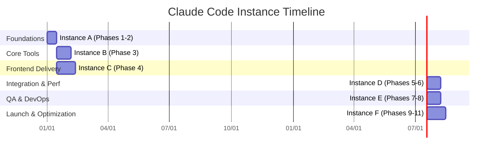

# Parallel Development Plan with Claude Code Instances

## Overview
- Operate dedicated Claude Code instances per major phase grouping defined in `Initial plan/AIO initial plan/tasks.md`.
- Sustain each instance from phase kickoff through completion, then archive output logs for downstream teams.
- Stagger start times so foundational work lands before dependent phases begin.

## Instance Allocations
- **Instance A** — Phases 1 & 2: environment, auth, API gateway, and shared contracts per `design.md`.
- **Instance B** — Phase 3: graphics, web, IDE, CAD, and video services after Instance A publishes service interfaces.
- **Instance C** — Phase 4: frontend implementation once API mocks and schemas are available.
- **Instance D** — Phases 5 & 6: Google Drive integration, shared storage, and performance tuning after core UI/services stabilize.
- **Instance E** — Phases 7 & 8: testing suites, CI/CD, and infrastructure once preceding instances deliver “release candidate” builds.
- **Instance F** — Phases 9–11: monitoring, documentation, launch readiness, and post-launch optimization following QA sign-off.

## Coordination & Handoff Requirements
- Maintain a shared tracker (e.g., `project/coordination/phase-log.md`) capturing status, deliverables, and outstanding risks.
- Each instance must produce: current branch/tag, updated artifacts/doc pointers, automated test and coverage results, and blockers prior to hand-off.
- Archive CLI transcripts or summaries so the next instance can replay decisions without rerunning completed work.

## Next Steps
1. Confirm execution slots/resources to run the planned Claude instances with the required overlap.
2. Draft and share the coordination tracker template so all instances log consistent information.

## Visual Coordination Diagram

